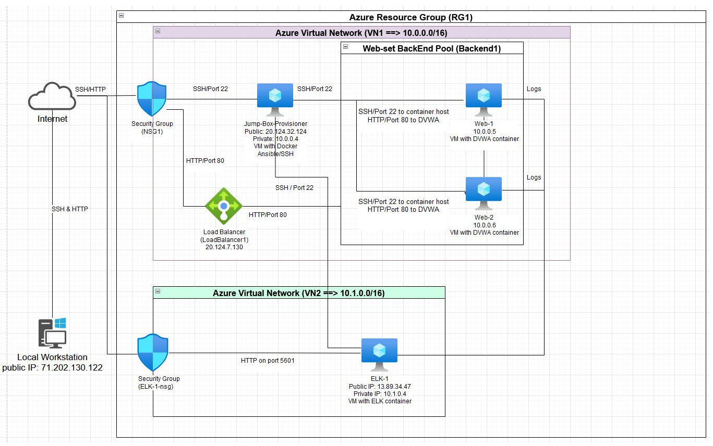
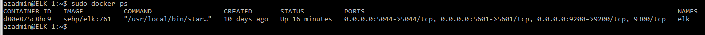
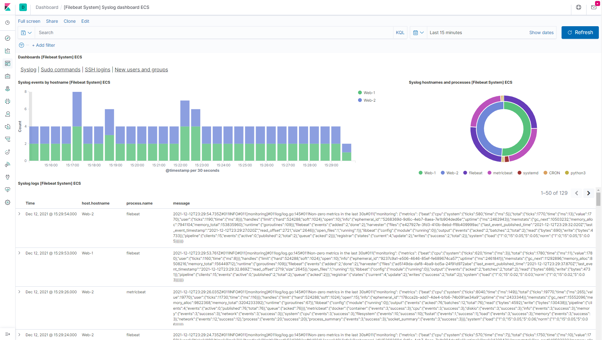
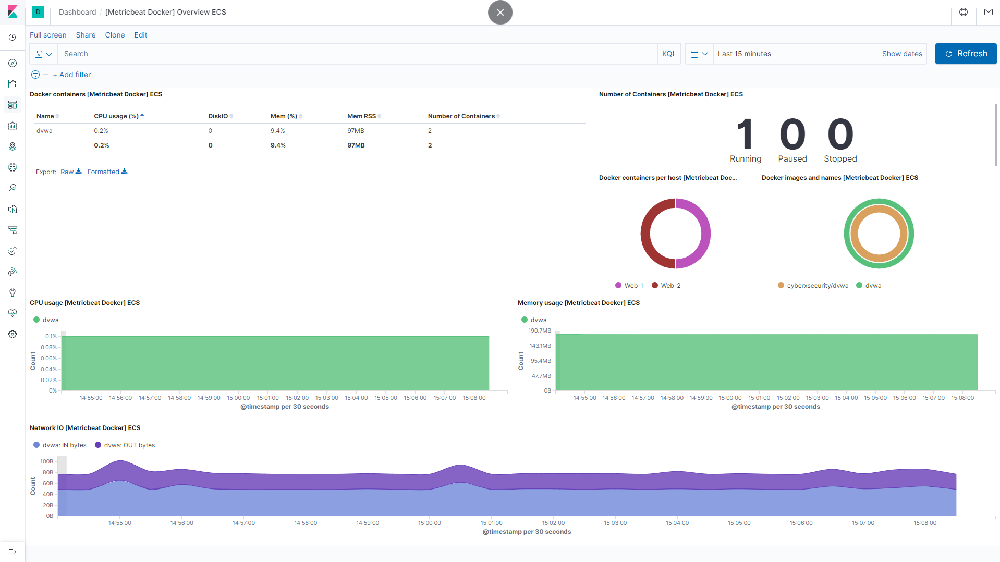
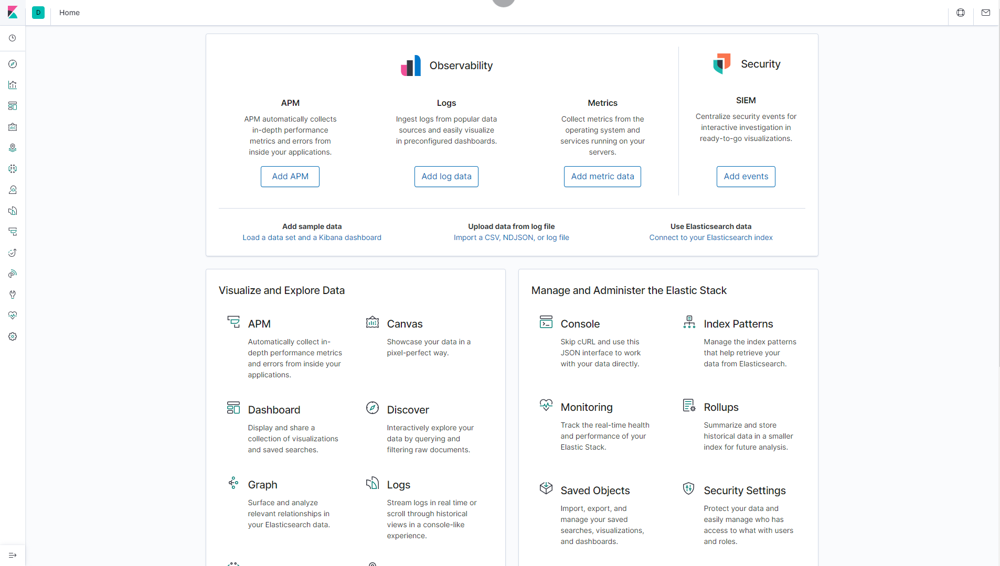

# HW13-ELK-STACK-PROJECT
Cybersecurity Class Project #1 - ELK Stack Project
## Automated ELK Stack Deployment

The files in this repository were used to configure the network depicted below.



These files have been tested and used to generate a live ELK deployment on Azure. They can be used to either recreate the entire deployment pictured above. Alternatively, select portions of the **_install-elk.yml_ playbook** file may be used to install only certain pieces of it, such as Filebeat.

  - _[install-elk.yml](Ansible/install-elk.yml)._

This document contains the following details:
- Description of the Topology
- Access Policies
- ELK Configuration
  - Beats in Use
  - Machines Being Monitored
- How to Use the Ansible Build


### Description of the Topology

The main purpose of this network is to expose a load-balanced and monitored instance of DVWA, the D*mn Vulnerable Web Application.

Load balancing ensures that the application will be highly **redundant and available**, in addition to restricting **incoming traffic** to the network.
- **What aspect of security do load balancers protect? _Load balancers protect the availability aspect of security; they evenly distribute network traffic to prevent failure caused by resource overloading._**
- **What is the advantage of a jump box? _Placing a jump box  between VMs on a network forces all traffic through this single node; we only have to worry about a few connections between a few machines, rather than connections between all machines._**

Integrating an ELK server allows users to easily monitor the vulnerable VMs for changes to the **file system** and system **metrics**.
- **What does Filebeat watch for? _Filebeat logs information about the file system, including which files have changed and when.  It is often used to collect log files from very specific files, such as logs generated by Apache, Microsoft Azure, Nginx, or MySQL._**
- **What does Metricbeat record? _Metricbeat records machine metrics, such as uptime._**

The configuration details of each machine may be found below.
_Note: Use the [Markdown Table Generator](http://www.tablesgenerator.com/markdown_tables) to add/remove values from the table_.

| Name                 | Function   | IP Address | Operating System |
|----------------------|------------|------------|------------------|
| Jump-Box-Provisioner | Gateway    | 10.0.0.4   | Linux            |
| Web-1                | Webserver  | 10.0.0.5   | Linux            |
| Web-2                | Webserver  | 10.0.0.6   | Linux            |
| ELK-1                | Monitoring | 10.1.0.4   | Linux            |

### Access Policies

The machines on the internal network are not exposed to the public Internet. 

Only the **Jump-Box-Provisioner** machine can accept connections from the Internet. Access to this machine is only allowed from the following IP addresses:
- **Add whitelisted IP addresses: _10.0.0.4 (jump-box-Provisioner itself)_ and _71.202.130.122_.**

Machines within the network can only be accessed by **SSH via Jump-Box-Provisioner's Ansible container**.
- **Which machine did you allow to access your ELK VM? _My Home Computer_**
- **What was its IP address? _71.202.130.122_**

A summary of the access policies in place can be found in the table below.

| Name                 | Publicly Accessible | Allowed IP Addresses      |
|----------------------|---------------------|---------------------------|
| Jump-Box-Provisioner | Yes                 | 10.0.0.4 71.202.130.122   |
| Web-1                | No                  | 10.0.0.4                  |
| Web-2                | No                  | 10.0.0.4                  |
| ELK-1                | No                  | 10.0.0.4                  |

### Elk Configuration

Ansible was used to automate configuration of the ELK machine. No configuration was performed manually, which is advantageous because...
- **What is the main advantage of automating configuration with Ansible? _The main advantage is that you can run the playbook as many times as you like very quickly, or use one single play to have identical configurations/commands executed on as many servers as you like, for servers are organized in groups._**

The playbook implements the following tasks:
- **Install docker.io**
- **Install pip3**
- **Set vm.max_map_count to 262144 in sysctl**
- **Install Docker Python module**
- **Download and launch a docker web container, sebp/elk:761**
- **Start Docker container**

The following screenshot displays the result of running `docker ps` after successfully configuring the ELK instance.



### Target Machines & Beats
This ELK server is configured to monitor the following machines: _(List the IP addresses of the machines you are monitoring)_
- **10.0.0.5   Web-1**
- **10.0.0.6   Web-2**

We have installed the following Beats on these machines: _(Specify which Beats you successfully installed)_
- **Filebeat**
- **Metricbeat**

These Beats allow us to collect the following information from each machine:
- **Filebeat logs information about the file system, including which files have changed and when.  It can collect logs generated by Apache, Microsoft Azure, Nginx, or MySQL, which we can use to identify suspecious activities.  For example, we can search through logs in Kibana to locate suspecious failed SSH login attempts.**


- **Metricbeat records machine metrics, which we can use to spot excessively high CPU usage and mitigate the situation.**



### Using the Playbook
In order to use the playbook, you will need to have an Ansible control node already configured. Assuming you have such a control node provisioned: 

SSH into the control node and follow the steps below:
- Copy the **install-elk.yml** playbook file to **Ansible control node**.
- Update the **hosts** file to include **webservers** and **elk**
```
[webservers]
10.0.0.5 ansible_python_interpreter=/usr/bin/python3
10.0.0.6 ansible_python_interpreter=/usr/bin/python3

[elk]
10.1.0.4 ansible_python_interpreter=/usr/bin/python3
```
- Run the playbook, and navigate to **http://ELK-1PublicIPaddress:5601/app/kibana to check that the installation worked as expected. _For example, http://13.89.34.47:5601/app/kibana_**.




- **Which file is the playbook? _install-elk.yml_.  Where do you copy it? _/etc/ansible_**
- **Which file do you update to make Ansible run the playbook on a specific machine? _hosts_.**
- **How do I specify which machine to install the ELK server on versus which to install Filebeat on? _One can specify the "elk" group to install on the ELK server and the "webservers" group to install Filebeat._**
- **Which URL do you navigate to in order to check that the ELK server is running? You can navigate to the following URL:_http://ELK-1PublicIPaddress:5601/app/kibana_. _For example, http://13.89.34.47:5601/app/kibana_**.


### Specific commands the user will need to run to download the playbook, update the files, etc.

- _Here are the coommands that should be executed on an Ansible control node._  Please note that **git clone** will not download project that contains playbooks and config files if git is not installed on the Ansible control code.  Please also note that **Username (_azadmin_)/IP Address (_0.124.32.124_) and docker container (_exciting_napier_)** for the ansible control conde will be different for your run.

```
$ ssh azadmin@20.124.32.124
Welcome to Ubuntu 20.04.3 LTS (GNU/Linux 5.11.0-1021-azure x86_64)

 * Documentation:  https://help.ubuntu.com
 * Management:     https://landscape.canonical.com
 * Support:        https://ubuntu.com/advantage

  System information as of Tue Dec 14 02:29:45 UTC 2021

  System load:  0.0                Processes:                108
  Usage of /:   10.5% of 28.90GB   Users logged in:          0
  Memory usage: 35%                IPv4 address for docker0: 172.17.0.1
  Swap usage:   0%                 IPv4 address for eth0:    10.0.0.4

 * Super-optimized for small spaces - read how we shrank the memory
   footprint of MicroK8s to make it the smallest full K8s around.

   https://ubuntu.com/blog/microk8s-memory-optimisation

32 updates can be applied immediately.
20 of these updates are standard security updates.
To see these additional updates run: apt list --upgradable


Last login: Mon Dec 13 22:46:58 2021 from 71.202.130.122
azadmin@Jump-Box-Provisioner:~$ sudo docker start exciting_napier
exciting_napier
azadmin@Jump-Box-Provisioner:~$ sudo docker attach exciting_napier
root@aaaae0e4c2e0:~# cd /etc/ansible
root@aaaae0e4c2e0:/etc/ansible#
root@aaaae0e4c2e0:~# git clone https://github.com/prgmr4hire/HW13-ELK-STACK-PROJECT.git
Cloning into 'HW13-ELK-STACK-PROJECT'...
remote: Enumerating objects: 39, done.
remote: Counting objects: 100% (39/39), done.
remote: Compressing objects: 100% (36/36), done.
remote: Total 39 (delta 2), reused 36 (delta 2), pack-reused 0
Unpacking objects: 100% (39/39), 996.84 KiB | 10.60 MiB/s, done.

root@aaaae0e4c2e0:~# sudo cp -r /etc/ansible/HW13-ELK-STACK-PROJECT/Ansible/* .
root@aaaae0e4c2e0:~# ansible-playbook install-elk.yml
```

### Notable configuration files changes

- Changes on remote_user in **ansible.cfg**

```

# default user to use for playbooks if user is not specified
# (/usr/bin/ansible will use current user as default)
#remote_user = root
remote_user = azadmin

```

- Change on IP address and port in **filebeat-config.yml**


```
#================================ Outputs ======================================

# Configure what output to use when sending the data collected by the beat.

#-------------------------- Elasticsearch output -------------------------------
output.elasticsearch:
  # Boolean flag to enable or disable the output module.
  #enabled: true

  # Array of hosts to connect to.
  # Scheme and port can be left out and will be set to the default (http and 9200)
  # In case you specify and additional path, the scheme is required: http://localhost:9200/path
  # IPv6 addresses should always be defined as: https://[2001:db8::1]:9200
  hosts: ["10.1.0.4:9200"]
  username: "elastic"
  password: "changeme" # TODO: Change this to the password you set
...
#============================== Kibana =====================================

# Starting with Beats version 6.0.0, the dashboards are loaded via the Kibana API.
# This requires a Kibana endpoint configuration.
setup.kibana:
  host: "10.1.0.4:5601" # TODO: Change this to the IP address of your ELK server


```

- Change on IP address and port in in **metricbeat-config.yml**


```

#============================== Kibana =====================================

# Starting with Beats version 6.0.0, the dashboards are loaded via the Kibana API.
# This requires a Kibana endpoint configuration.
setup.kibana:
  host: "10.1.0.4:5601"

  # Kibana Host

...

#-------------------------- Elasticsearch output ------------------------------
output.elasticsearch:
  # TODO: Change the hosts IP address to the IP address of your ELK server
  # TODO: Change password from `changem` to the password you created
  hosts: ["10.1.0.4:9200"]
  username: "elastic"
  password: "changeme"


```

